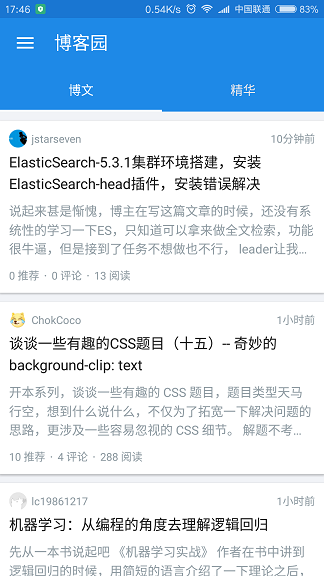
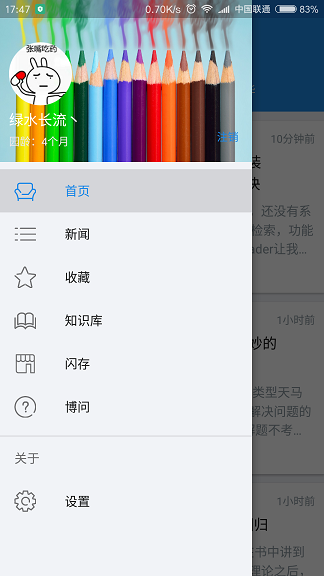
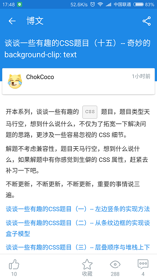

# 介绍

一款优雅的博客园Android客户端，Xamarin App，Material Design风格。如有意见反馈或bug提交，请加QQ群(181050206)交流.

# AccessToken

博客园Open Api需要申请调用权限，Open Api基于OAuth进行验证，感谢[博客园](http://www.cnblogs.com/)官方提供的支持

# 关于Fork

Fork本项目之前需要先下载[XamarinSDK](https://github.com/JoesWeek/XamarinSDK)项目,生成后添加引用,要不然会报找不到相关引用的错误

## 下载

[酷安应用商店](http://www.coolapk.com/apk/com.android.cnblogs)

## 支持功能

- 登录博客园

- 查看已发布的博客

- 查看博文，新闻，知识库，添加评论

- 添加收藏，编辑收藏，删除收藏

- 发布闪存，评论闪存

- 支持查看，发布博问，发表回答和评论

- 支持分享博文，新闻，知识库，博问到微信和新浪微博

- 支持搜索功能


## 截图






## 联系我

QQ群： [181050206](http://shang.qq.com/wpa/qunwpa?idkey=5c281d37638467fb0f411484dcd513b89ba82b58decb8518cc2523b95232dd9b)

JoesWeek

[476920650@qq.com](mailto:476920650@qq.com)

## License
```
   Copyright 2017 JoesWeek

   Licensed under the Apache License, Version 2.0 (the "License");
   you may not use this file except in compliance with the License.
   You may obtain a copy of the License at

       http://www.apache.org/licenses/LICENSE-2.0

   Unless required by applicable law or agreed to in writing, software
   distributed under the License is distributed on an "AS IS" BASIS,
   WITHOUT WARRANTIES OR CONDITIONS OF ANY KIND, either express or implied.
   See the License for the specific language governing permissions and
   limitations under the License.
```
